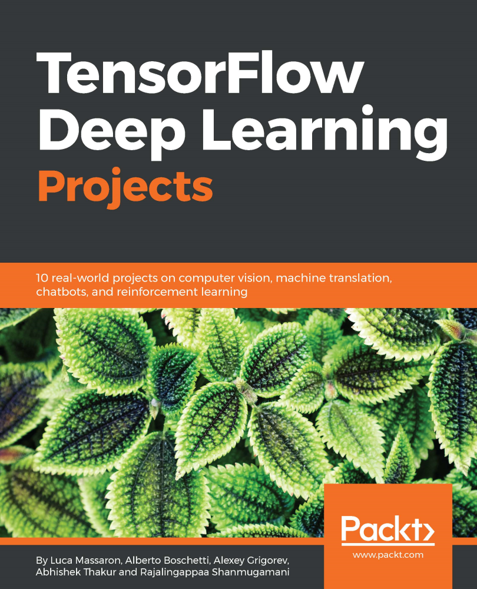

# TensorFlow Deep Learning Projects
by <B>Luca Massaron, Alberto Boschetti, Alexey Grigorev, Abhishek Thakur, Rajalingappaa Shanmugamani</B>

Released March 2018 
Publisher(s): Packt Publishing 
ISBN: 9781788398060 

This is the code repository for [TensorFlow Deep Learning Projects](https://www.packtpub.com/big-data-and-business-intelligence/tensorflow-deep-learning-projects), published by [Packt](https://www.packtpub.com/?utm_source=github). It contains all the supporting project files necessary to work through the book from start to finish.
## About the Book
TensorFlow is one of the most popular frameworks used for machine learning and, more recently, deep learning. It provides a fast and efficient framework for training different kinds of deep learning models, with very high accuracy. This book is your guide to master deep learning with TensorFlow with the help of 10 real-world projects.

TensorFlow Deep Learning Projects starts with setting up the right TensorFlow environment for deep learning. Learn to train different types of deep learning models using TensorFlow, including Convolutional Neural Networks, Recurrent Neural Networks, LSTMs, and Generative Adversarial Networks. While doing so, you will build end-to-end deep learning solutions to tackle different real-world problems in image processing, recommendation systems, stock prediction, and building chatbots, to name a few. You will also develop systems that perform machine translation, and use reinforcement learning techniques to play games.

By the end of this book, you will have mastered all the concepts of deep learning and their implementation with TensorFlow, and will be able to build and train your own deep learning models with TensorFlow confidently.

## Instructions and Navigation
All of the code is organized into folders. Each folder starts with a number followed by the application name. For example, Chapter02.

